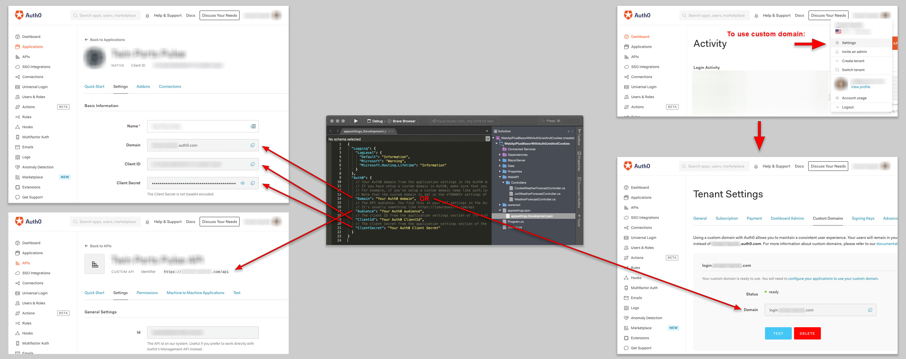
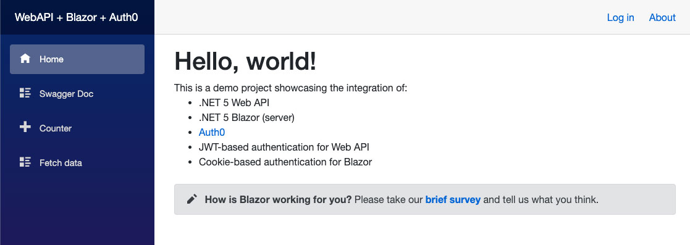
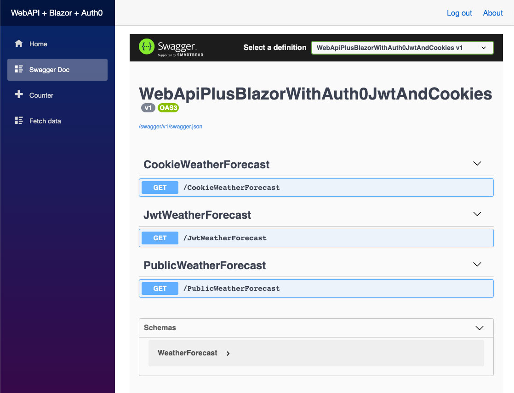

# .NET 5 WebApi + Blazor + Auth0 JWT & cookies
A demo of .NET 5 Web API + Blazor + Auth0 with JWT and cookie authentication

## Setup
Make sure you first follow the Auth0 instructions for setting up your Auth0 account:

#### Tenant setup

https://auth0.com/docs/get-started/learn-the-basics

#### Application setup

https://auth0.com/docs/applications/set-up-an-application/register-native-applications

(Make sure you properly set the callback values in Auth0!!! Usually `https://localhost:5001/callback`)

#### API setup

https://auth0.com/docs/get-started/set-up-apis

#### Setup identity providers (Connections)

https://auth0.com/docs/identityproviders

#### Edit appsettings

Then replace the values in `appsettings.Development.json` with the values from your Auth0 settings.

## Try it out

When you debug the app, you should be presented with a Blazor app that looks very similar to a default Blazor app. You'll see a "Login" link in the upper-right which allows you to login with Auth0.

The "Swagger Doc" menu item will present you with interactive documentation for the Web API controllers.

#### PublicWeatherForecast

This controller requires no authentication. You can use it without logging in.

#### CookieWeatherForecast

This controller requires cookie authentication. If you try to execute its endpoint before logging in, you'll see an error message.

#### JwtWeatherForecast

This controller requires JWT authentication. In order to make successful requests, you'll need issue requests to the endpoint using somerthing like [Postman](https://www.postman.com/), [HttpClient](https://docs.microsoft.com/en-us/dotnet/api/system.net.http.httpclient?view=net-5.0), or [Refit](https://github.com/reactiveui/refit) (my preferred library for creating http clients for use in Xamarin apps). Each HTTP request must contain an Authorization header with contents of "Bearer {your JWT token}".

